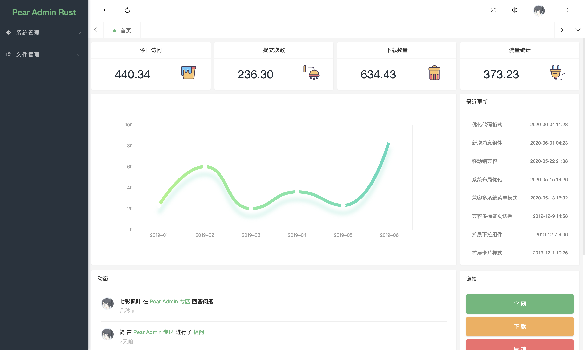
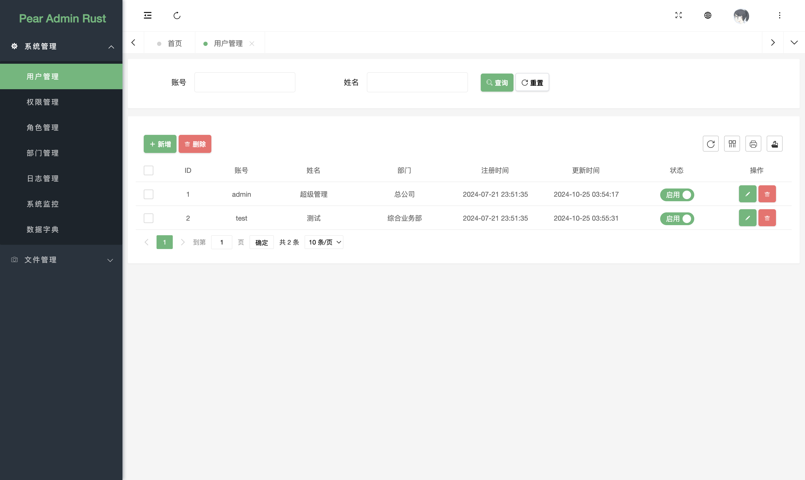
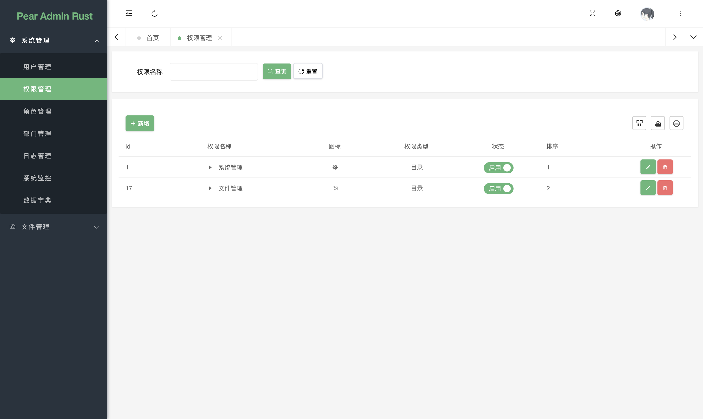
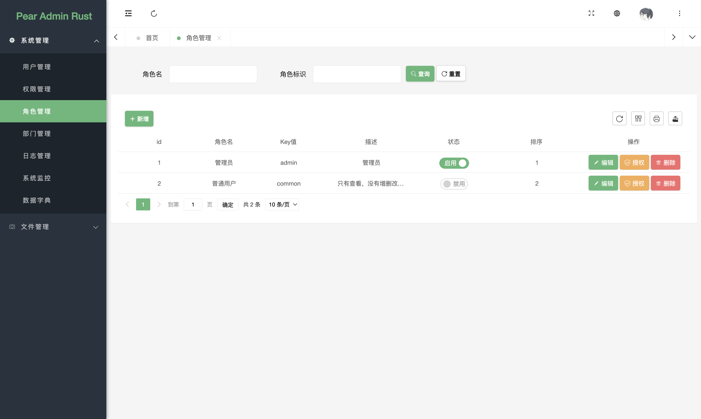
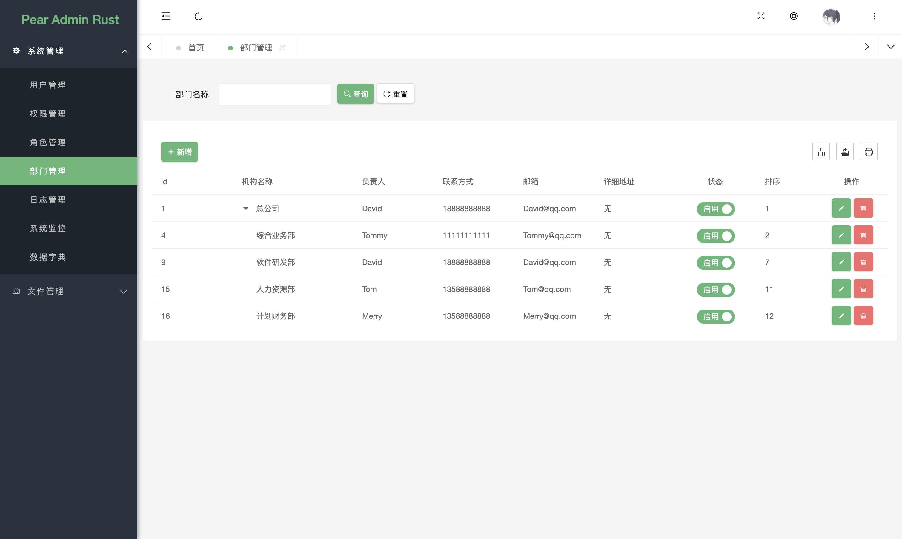
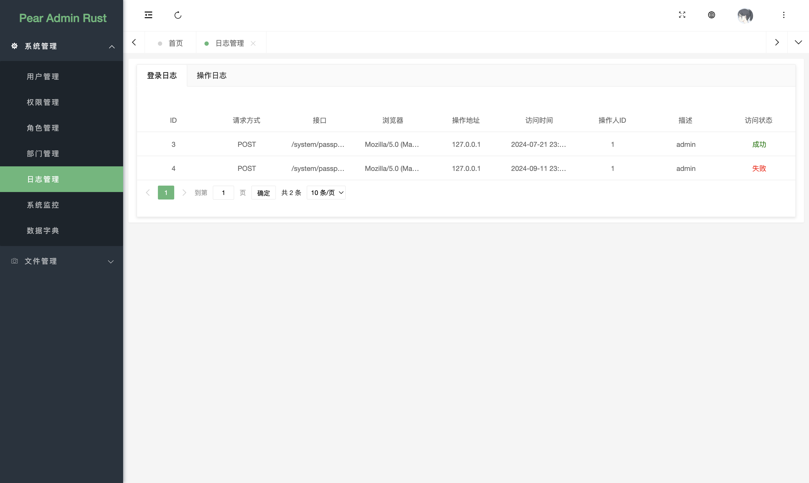
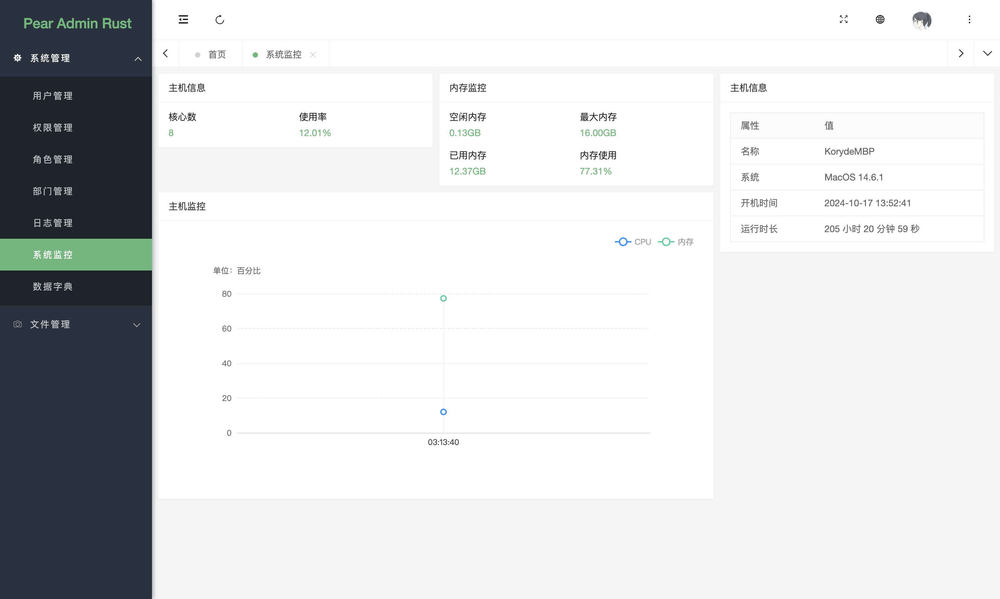
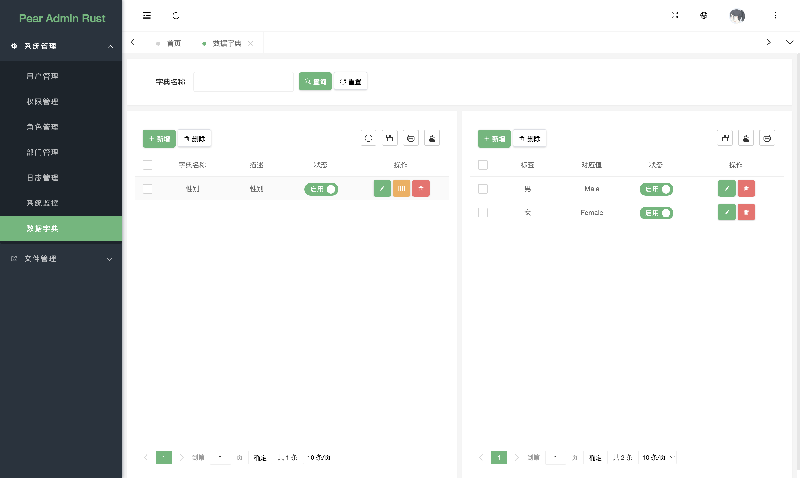
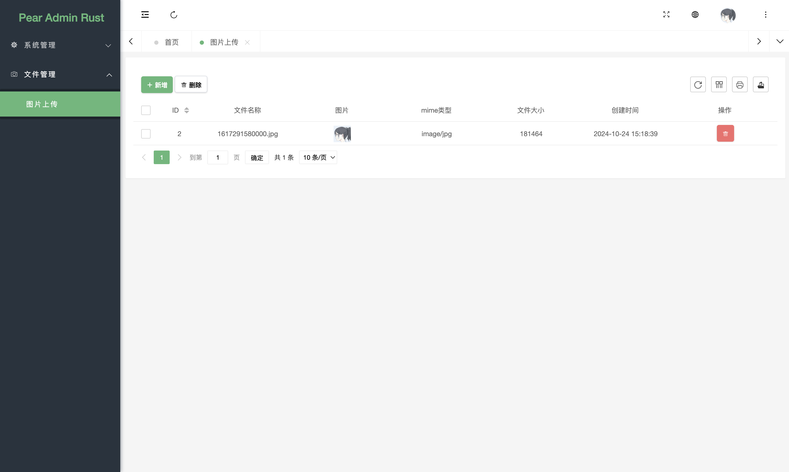

<div align="center">
<br/>
<br/>
  <h1 align="center">
    Pear Admin Rust
  </h1>
</div>

# 项目简介

Pear Admin Rust 基于 Axum 框架 的后台管理系统，拥抱高性能的 Rust 语言，通过使用本系统，即可快速构建你的功能业务。
项目旨在为 Rust 开发者提供一个后台管理系统的模板，可以快速构建信息管理系统。

项目使用 Axum + SeaORM + 权限验证 + 数据序列化与验证，以此方式集成了若干不同的功能。

# 内置功能

- [x] 用户管理：用户是系统操作者，该功能主要完成系统用户配置。
- [x] 权限管理：配置系统菜单，操作权限，按钮权限标识等。
- [x] 角色管理：角色菜单权限分配。
- [x] 部门管理：配置部门信息。
- [x] 操作日志：系统正常操作日志记录和查询；系统异常信息日志记录和查询。
- [x] 登录日志：系统登录日志记录查询包含登录异常。
- [x] 服务监控：监视当前系统 CPU、内存、运行时长等相关信息。
- [x] 文件上传：图片上传示例

# 项目结构

## 应用结构

```
# 项目根目录
pear_admin_rust/
│
├── query_filters_macros/   # 包含查询过滤器的宏定义
├── query_filters_traits/   # 包含查询过滤器的特征定义
│
├── server/                 # 服务器相关代码
│   ├── src/                # 源代码目录
│   │   ├── controller/     # 控制器模块
│   │   ├── middleware/     # 中间件模块
│   │   ├── models/         # 数据模型模块
│   │   ├── router/         # 路由模块
│   │   ├── service/        # 服务模块
│   │   ├── utils/          # 工具模块
│   │   ├── database.rs     # 数据库连接和配置
│   │   ├── lib.rs          # 库的入口文件
│   │   └── main.rs         # 主程序入口文件
│   └── Cargo.toml          # 服务器的Cargo配置文件
│
├── Cargo.lock              # 锁定依赖版本的文件
├── Cargo.toml              # 项目的Cargo配置文件
└── README.md               # 项目说明文件
```

## 资源结构

```
# 项目根目录
pear_admin_rust/
├── static/                 # 静态资源目录
│   ├── admin/              # 后台管理相关静态资源
│   ├── component/          # 组件相关静态资源
│   ├── config/             # 配置相关静态资源
│   └── upload/             # 上传文件相关静态资源
└── template/               # 模板文件目录
  ├── system/             # 系统模块模板
  │   ├── dept/           # 部门管理模板
  │   ├── dict/           # 字典管理模板
  │   ├── photo/          # 照片管理模板
  │   ├── power/          # 权限管理模板
  │   ├── role/           # 角色管理模板
  │   ├── system_log/     # 系统日志模板
  │   └── user/           # 用户管理模板
  ├── index.hbs           # 首页模板
  ├── login.hbs           # 登录页面模板
  ├── monitor.hbs         # 系统监控模板
  └── welcome.hbs         # 欢迎页面模板
```

# 项目安装

```bash
# 下载
git clone https://github.com/DavidHSiang/pear_admin_rust.git
# 进入到项目目录
cd pear_admin_rust
# 构建项目
cargo build
# 启动服务器
RUST_LOG=info cargo run
```

# 未完成工作

- [ ] 从配置文件中读取配置
- [ ] 接入 mysql、pg 等第三方数据库

# 预览项目

> 欢迎页面



> 用户页面



> 权限页面



> 角色页面



> 部门管理



> 系统日志



> 系统监控



> 字典管理



> 照片页面


